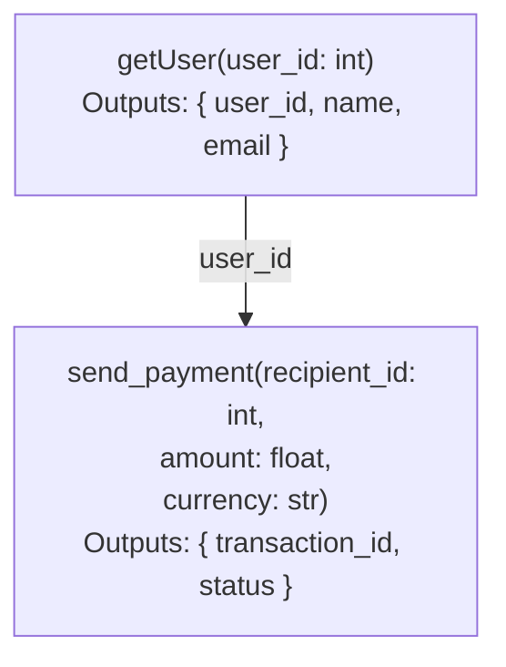
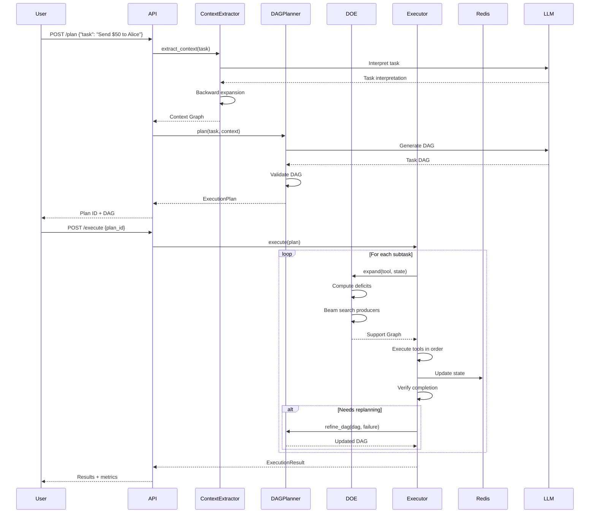

# HyperFlow AI

<div align="center">

**Schema-Aware Agent Planning with Tool-Schema Hypergraphs**

[](https://www.python.org/downloads/)
[](https://fastapi.tiangolo.com/)
[](https://opensource.org/licenses/MIT)
[](https://github.com/psf/black)

</div>

---

##  What is HyperFlow AI?

HyperFlow AI is a **production-grade implementation** of the HyperAgent research paper, transforming cutting-edge academic research into a scalable, enterprise-ready agent planning engine.

Instead of the traditional **sequential, trial-and-error approach** used by ReAct agents, HyperFlow AI:

- **Constructs schema-aware hypergraphs** that model fine-grained tool dependencies at the parameter level
- **Plans globally** by generating Task DAGs with explicit data dependencies
- **Executes dynamically** using Deficit-Oriented Expansion for state-conditioned tool composition
- **Enables parallel execution** by identifying independent subtasks

Think of it as **"LangGraph meets Kubernetes for AI Agents"** — a complete planning and execution framework that understands exactly which outputs feed into which inputs, reducing redundant API calls and token consumption by **up to 40%**.


---

## Why This Matters?

### The Problem with Current Agents

Current LLM agents (ReAct, etc.) are **myopic** — they select tools sequentially, without understanding what's needed to make those tools work:

```bash
Agent: "I'll call send_payment"
→ Error: "recipient_id required"
Agent: "Let me get the user_id first"
→ Calls get_user
→ Success! Now call send_payment
```

text

This leads to:
- ❌ **Wasted API calls** — exploring dead ends
- ❌ **High token consumption** — repeated reasoning loops
- ❌ **No parallel execution** — sequential everything
- ❌ **Brittle** — fails when tools change

### The HyperFlow AI Solution

We model **data flow**, not just tool names:


Now the agent knows:

- getUser must be called before send_payment

- The user_id output feeds directly into recipient_id

- These can be parallelized with other independent tasks

---

##  Key Features

###  Hypergraph Construction
- **Schema-level dependencies** — model which outputs satisfy which inputs
- **OpenAPI parsing** — automatically build hypergraphs from API specs
- **Semantic inference** — use embeddings to discover hidden dependencies
- **Manual refinement** — expert annotations for domain-specific knowledge

###  Schema-Aware Planning
- **Task interpretation** — LLM understands the task at a schema level
- **Context extraction** — backward expansion to recover prerequisite tools
- **DAG generation** — create directed acyclic graphs of subtasks
- **Dependency validation** — ensure data flows are complete and correct

###  Deficit-Oriented Expansion
- **State-conditioned** — adapts to what's already available
- **Beam search** — explores multiple compositions simultaneously
- **Deficit resolution** — automatically finds producers for missing inputs
- **Complete graphs** — ensures every required input has a producer

###  Dynamic Execution
- **Topological execution** — runs subtasks in dependency order
- **Parallel subtasks** — executes independent subtasks concurrently
- **State management** — Redis-backed agent state with bindings
- **Retry logic** — exponential backoff with configurable retries
- **Replanning** — adapts when subtasks fail

###  Observability
- **OpenTelemetry** — distributed tracing
- **Prometheus** — metrics collection
- **Grafana** — real-time dashboards
- **Structured logging** — JSON logs for analysis
- **Execution trace** — complete audit trail

---

##  Architecture


### Data Flow


--- 

### Start
#### Prerequisites
```bash
# Python 3.11+
python --version

# Install dependencies
pip install -r requirements.txt
```

---

### Installation

```bash 
# Clone the repository
git clone https://github.com/yourusername/hyperflow-ai.git
cd hyperflow-ai

# Install in development mode
pip install -e .

# Run the demo
python -m src.main demo
```

---
### Build a Hypergraph from OpenAPI
 ```bash
# Parse an OpenAPI spec and build the hypergraph
python -m src.main build --spec examples/payment_api.json --output hypergraph.json
```

---

###

use the api

```python
import requests
import json

# Plan a task
response = requests.post(
    "http://localhost:8000/api/v1/plan",
    json={
        "task": "Send $50 to alice@example.com and notify bob@example.com"
    }
)
plan = response.json()
print(f"Plan ID: {plan['plan_id']}")
print(f"Subtasks: {plan['subtask_count']}")

# Execute the plan
response = requests.post(
    "http://localhost:8000/api/v1/execute",
    json={
        "plan_id": plan['plan_id'],
        "task": "Send $50 to alice@example.com",
        "dag": plan['dag']
    }
)
result = response.json()
print(f"Status: {result['status']}")
print(f"Results: {result['results']}")

```

## How It Works

### 1. Tool-Schema Hypergraph
We model tools as hyperedges connecting input schemas to output schemas:
 ```python
 # Each tool becomes a hyperedge
payment_tool = HyperEdge(
    name="send_payment",
    input_nodes={recipient_id, amount, currency},
    output_nodes={transaction_id, status}
)

# Dependencies are port-level links
dependency = Dependency(
    source_node=get_user.user_id,    # Output from getUser
    target_node=send_payment.recipient_id,  # Input to sendPayment
    weight=0.95
)
```
This fine-grained modeling enables:

- Exact data flow tracking — know exactly which output goes to which input

- Missing input detection — identify what's missing before execution

- State-aware expansion — only add producers for what's actually needed

### 2. Deficit-Oriented Expansion(DOE)
The core algorithm (from the HyperAgent paper):
```python
def deficit_oriented_expansion(terminal_tool, state):
    """
    Starting from a terminal tool, find all prerequisite tools
    needed to execute it with the current state.
    """
    # Step 1: What inputs are missing?
    deficits = compute_deficits(terminal_tool, state)
    
    # Step 2: Beam search to find producers
    candidates = [(terminal_tool, deficits)]
    
    while deficits:
        # Find tools that resolve deficits
        producers = find_producers(deficits)
        
        # Score by overlap with deficit set
        scored = score_by_overlap(producers, deficits)
        
        # Prune to beam width
        candidates = prune(scored, beam_width=5)
        
        # Update deficits with producer requirements
        deficits = compute_deficits(candidates)
    
    return complete_support_graph(candidates)

```
### 3. State-Conditioned Execution
The execution engine adapts to what's already available:

```python
# Initial state: We already have Alice's email
state = AgentState(bindings={"alice_email": "alice@example.com"})

# Support graph for "send payment to Alice"
support_graph = doe.expand(send_payment, state)
# → Only need to get user_id (email is already available)

# The engine knows to skip the email fetch
execution_order = [
    "get_user_by_email",  # Only this is needed
    "send_payment"
]

```


